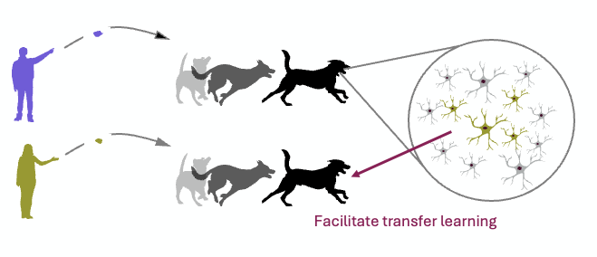
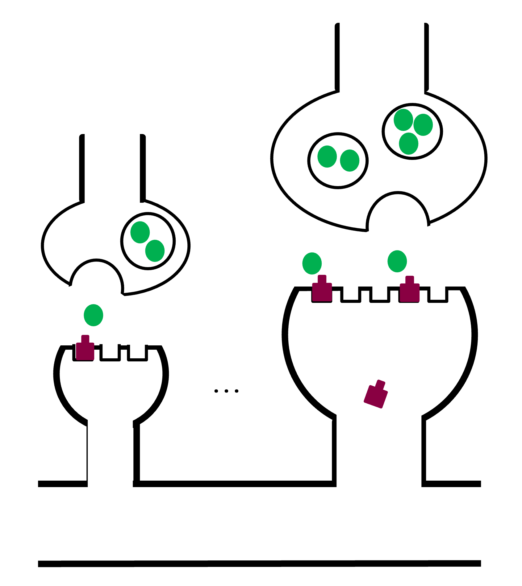

Work:
- Movement prediction

- Transfer learning and generalization

- Learning on a synaptic scale

Applications in industry:
- Wearables: user intent such as clicking on a button
- Automotive
- Assistive devices
- Healthcare: Using wearables to measure emotions in prefrontal cortex (front head) for therapeutic purposes.
- Advertising: Measure the emotional effect of advertisement.

<!--more-->
