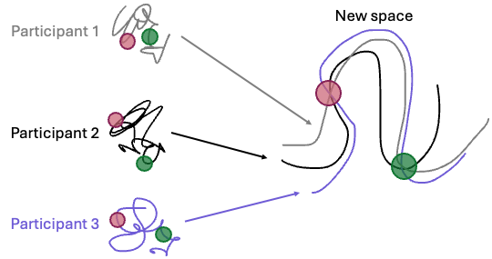
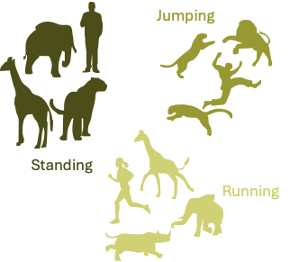

Work:
- Using parallelization and GPU/CPU to improve data analysis pipelines
- Denoising neural data and extracting important features

- Dealing with small datasets

- Classifying behavior in images

Application in industry:
- Healthcare: Analyzing condition of motion and sensory processing of each patient
- Robotics: Develop robots with motion inspired by real humans
- Assistive Devices: tackling only motion dimension of a human and built assistive devices based on that
- Automated data labelling to train models for smart wearables
- Various Data analysis cases where limited time series data is a problem

<!--more-->
