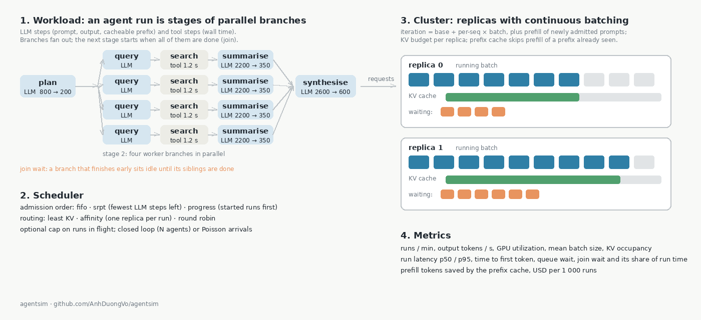
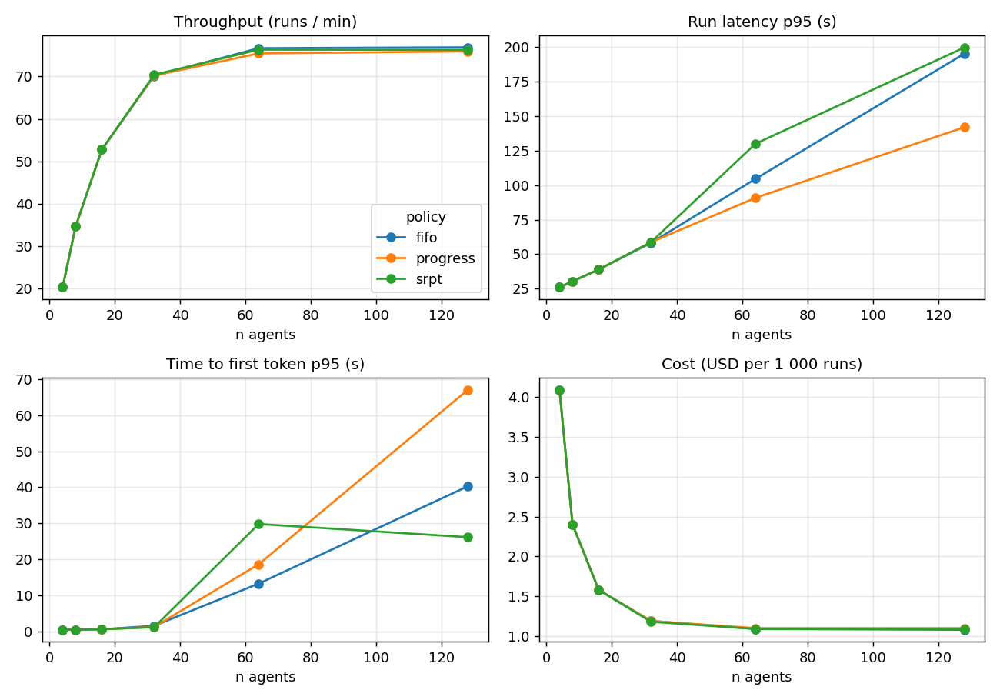

An agent run is not one prompt. It is a graph of LLM calls, tool calls and waits, often with sub-agents fanning out and joining again, and a cluster that serves agents behaves differently from one that serves chat. agentsim replays thousands of such runs against a model of a serving cluster and reports throughput, latency percentiles, the time lost at synchronization points, GPU utilization and cost per run. It is pure Python with one dependency, runs a 300-run sweep in a few seconds, and can be calibrated against a real endpoint. Code: [github.com/AnhDuongVo/agentsim](https://github.com/AnhDuongVo/agentsim).

## How it is modelled

**Workload.** A run is a list of stages. Each stage holds one or more branches that run in parallel (a fan-out), and the next stage starts only when all branches have finished (a join). A branch is a sequence of steps: an LLM call with prompt tokens, output tokens and an optional cacheable prefix, or a tool call with a wall time. Four synthetic profiles are built in (single-turn chat, a ReAct loop whose prompt grows with every observation, a plan / fan-out / synthesise research agent, and the extract / draft / parallel-judge / revise shape of consult-to-note), and real traces from [agenteval](https://github.com/AnhDuongVo/agenteval) are converted directly.

**Cluster.** Identical replicas, each with continuous batching: a decode iteration costs a base time plus a per-sequence time and emits one token for every running sequence; a newly admitted prompt adds its prefill time to the iteration that admits it. Each replica has a KV-cache budget, a batch limit and a prefix cache that skips the prefill of a prefix it has already seen.

**Scheduler.** Which waiting request a replica admits next (fifo, fewest LLM steps left first, or started runs first), which replica a run goes to (most free KV, one replica per run for prefix locality, or round robin), and an optional cap on runs in flight. Load is either a fixed number of concurrent agents or Poisson arrivals.

## What it shows

The figure sweeps the number of concurrent agents for a mixed workload (half chat, 30% ReAct, 20% fan-out) on two replicas with a batch limit of 32. Throughput saturates near 32 agents; beyond that, extra agents only add queueing, so p95 run latency and time to first token climb while cost per run stops falling. The policies agree until the replicas saturate and then differ in whom they make wait: with 128 agents, shortest-remaining-first more than halves the median latency of chat and ReAct runs (23.5 s to 10.0 s and 162 s to 56 s) and charges it to the fan-out runs (138 s to 168 s). For the fan-out profile on its own, adding replicas cuts latency almost linearly while the share of run time spent waiting at joins stays near 11%, because that wait comes from the spread of the branches rather than from queueing.

The recording (64 s) runs the fan-out profile, compares fifo and srpt on the mixed workload, produces the sweep figure, and shows the benchmark and calibration steps.



## Calibration and limits

The default cluster parameters are of the order one sees for a model of around 8B parameters on one data-centre GPU; they are not measurements. `agentsim bench` sends concurrent streaming requests to any OpenAI-compatible server (vLLM, NIM, TGI, Ollama, a hosted API) and records time to first token and inter-token latency, and `agentsim calibrate` fits the decode and prefill parameters to that. The model has one replica per model copy (no tensor parallelism or disaggregated prefill), charges prefill whole in the admitting iteration, and reserves KV for prompt plus output up front, so relative comparisons (policy A against B, two replicas against four) are more reliable than absolute numbers. The README lists the rest.

## Code

[agentsim](https://github.com/AnhDuongVo/agentsim) (Apache-2.0). Related: [agenteval](https://github.com/AnhDuongVo/agenteval) supplies the traces; [consult-to-note](https://github.com/AnhDuongVo/consult-to-note) is the shape behind the clinical profile.
