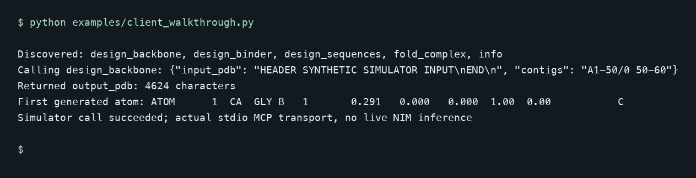
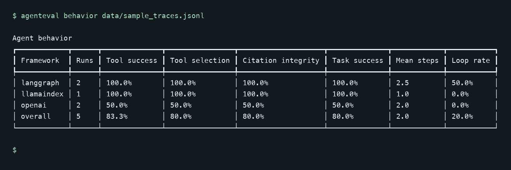
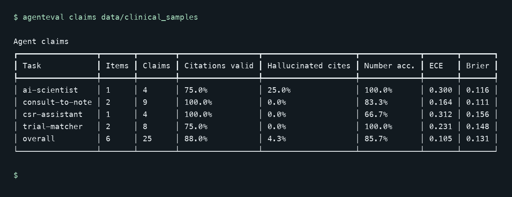

These tools address recurring integration and evaluation problems I encountered while building agents. They support selected models, APIs and trace formats, with explicit offline examples and documented limits.

## mcp-bionemo: a typed integration boundary

[mcp-bionemo](https://github.com/AnhDuongVo/mcp-bionemo) exposes selected BioNeMo NIM calls through typed MCP tools and an offline simulator. Its focus is a lightweight interface developers can inspect and test. NVIDIA also offers scientific agent tooling; this project does not claim to be the only integration route.

**Example scope:** Actual local MCP discovery and design_backbone invocation against the simulator. This does not validate live BioNeMo NIM endpoints.

Install `pip install -e ".[dev]"` and run `pytest -q` for simulator and mocked-client tests. The repository includes a stdio MCP-client walkthrough. Set `BIONEMO_BACKEND=live` only when you have endpoint access, credentials and scientifically appropriate inputs. The simulator exercises integration logic and produces meaningless scientific scores.

## agenteval: metrics with explicit definitions

[agenteval](https://github.com/AnhDuongVo/agenteval) normalizes selected OpenAI-style, LangGraph and LlamaIndex traces. Assistant tool requests and responses are reconciled into one logical call before calculating success and loop metrics. Exact tool-set accuracy and call precision penalize unnecessary tools; expected-tool coverage remains a separate metric.

**Example scope:** Current CLI scoring of bundled traces and claim labels. Scores describe these fixtures, not model quality in production.

Install `pip install -e ".[dev]"`, run `pytest -q`, then inspect `agenteval --help` for the sample trace and claim workflows.

Citation integrity checks whether cited IDs exist in the retrieved set. Numerical screening checks values against supplied evidence. These metrics do not prove semantic grounding; the legacy `grounding_rate` output is a compatibility alias for citation integrity. Expert-labelled outcomes and calibration studies require a suitable dataset.

## rag-guidelines: inspectable retrieval checks

[rag-guidelines](https://github.com/AnhDuongVo/rag-guidelines) demonstrates retrieval over a small guideline corpus and sentence-level citation, lexical, polarity and numerical screening. Every cited ID must exist; one valid citation cannot hide an invalid one.

**Example scope:** Synthetic extractive lexical screening with bundled guideline excerpts. This is not a live clinical LLM evaluation.

Install `pip install -e ".[dev]"`, run `pytest -q`, then try `rag ask "What is the HbA1c target?"`. The default answer generator is offline and extractive; a live model backend is optional.

Word overlap and matching numbers are useful screening signals, not evidence of clinical entailment. Review the source passages and consult the repository’s limitations before adapting the example.

## Learn by changing a trace

The [40-minute evaluation workshop](https://github.com/AnhDuongVo/agenteval/blob/main/docs/workshop.md) includes an offline installation path, a trace-mutation exercise, automated checks and troubleshooting. It shows how a useful score can still leave semantic correctness unresolved.
