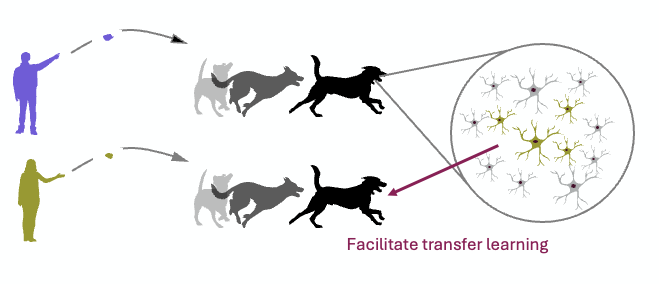

This was the main project of my PhD at ETH Zurich (2021 to 2026). It is neuroscience rather than agentic AI, but the question behind it, how a system keeps what it learned while adapting to a changed situation, is one that machine learning faces as well.

## The question

Animals, including us, constantly relearn: a signal that meant danger yesterday can mean safety today. The medial prefrontal cortex (mPFC) is known to be involved in this kind of flexible behaviour, but how its neurons represent a rule, and what happens to that representation when the rule changes, is still not well understood.

## The approach

I studied this in a two-tone active avoidance task: an animal learns which of two tones predicts an unpleasant stimulus and avoids it, and later the meaning of the tones is reversed and it has to relearn. While the animals learned and relearned, large populations of mPFC neurons were recorded together with their behaviour.

| Step | What I did | Tools |
| --- | --- | --- |
| Data | Large-scale neural and behavioural time series across learning and reversal | Python, Matlab |
| Behaviour | Models that predict movement and avoidance from the recordings | PyTorch, scikit-learn |
| Representations | Analysis of how the population encodes tones, rules and actions over time | Dimensionality reduction, decoding |
| Limited data | Self-supervised methods for sessions with few trials | PyTorch |
| Scale | Rebuilt the analysis pipeline for GPUs and the cluster, one computation went from 30 days to 1 day | CUDA, HPC |

## The finding

I identified a population I call "transfer neurons": cells whose activity supports generalisation across the changing task contexts, so the network does not have to relearn the task from scratch after the rule flips. Parts of this work were presented at the Bernstein Conference (2023), FENS (2024) and the Society for Neuroscience meeting (2024), and the manuscript (Vo, Ehret et al.) is in preparation.

## Why it matters beyond neuroscience

- **Transfer and generalisation.** Keeping useful structure while the task changes is the same problem continual learning and robust AI systems face.
- **Representations that stay stable.** The brain reuses parts of a representation instead of overwriting it, which is a useful idea for models that should not forget.
- **Working with messy, high-dimensional data.** Noisy recordings, few trials per condition and long time series taught me most of what I know about evaluating models honestly, which carries straight into how I evaluate agents.
